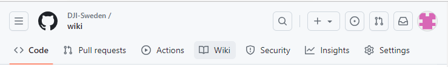
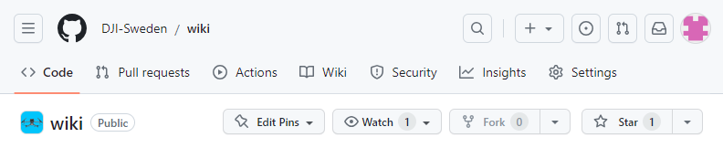
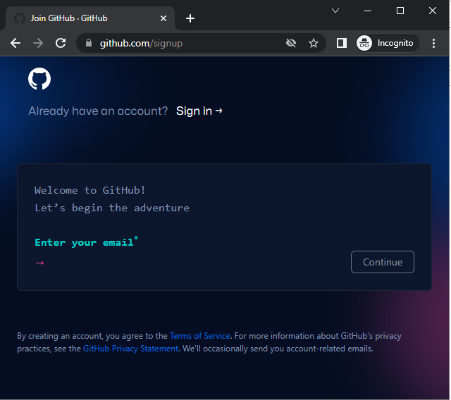

# DJI Sweden - Wiki

## 1. Beskrivning

Detta är den GitHub-sajt som används som Wiki för DJI Sweden. 

Klicka bara på `Wiki` för att se den.

Då det normalt inte går att granska en Wiki innan den publiceras används tekniken i Git för detta. 

Alla filerna för Wiki:n finns därmed på https://github.com/DJI-Sweden/wiki_repo istället.

Det innebär att hela Wikin går att hantera med de metoder och verktyg som används i Git för att få full kontroll på historik samt godkännande innan publicering. Dvs. i enlighet med principen `Documentation as Code (DaC)`.

Alla ändringar görs i filerna på wiki_repo. När något godkänts via en peer-review (sk. `Pull Request`), så publiceras det hit här till sajten wiki.

## 2. Användning/Hur gör jag

* Skaffa ett GitHub konto
* Gör din ändring/ar
* Be att få den granskad
* Invänta publicering (ofta samma dag)

ReadMe:n på [wiki_repo](https://github.com/DJI-Sweden/wiki_repo/blob/master/README.md) innehåller detaljerade instruktioner. 

## 3. Hjälp oss synas, ge oss en stjärna

GitHub spärrar normalt sina Wikis från att bli indexerade av Google, förutom de som klassas som seriösa. Detta är ett sätt från GitHub att undvika missbruk.

För att denna Wiki ska klassas som seriös behöver den 500 "likes", dvs. 500 stjärnor på GitHub. 

Så [skapa gärna ett konto på GitHub](https://github.com/signup) och ge oss en stjärna.  

Du behöver ett konto i vilket fall om du vill uppmärksamma oss på fel i Wikin i materialet på wiki_repo eller vill föreslå nya artiklar utan att skriva om dem själv direkt via GitHub.

## 4. Kontakter

* Om du har frågor kring hur detta fungerar så ta kontakt med någon admin på Facebook i gruppen [DJI Sweden](https://www.facebook.com/groups/djisweden).
